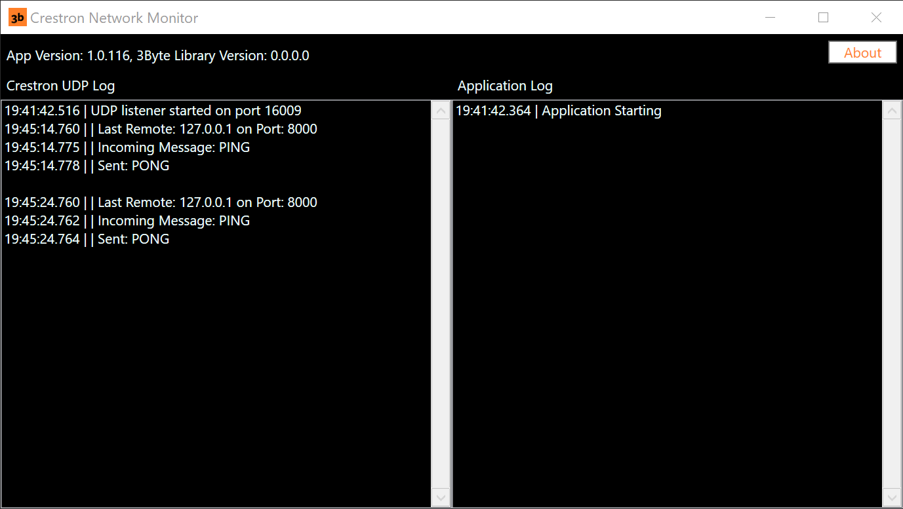
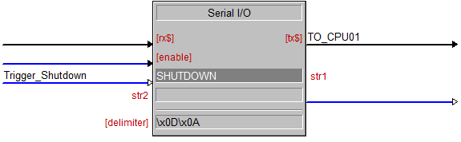
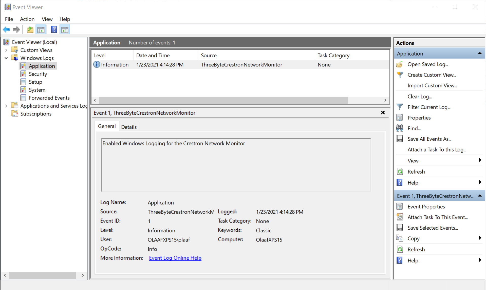

Master Branch | Dev Branch
------------ | -------------
<iframe src="<http://olaaf.ddns.net/>/externalStatus.html"/>

[/statusIcon)](3byte.beta.teamcity.com/viewType.html?buildTypeId=myID&guest=1) | [/statusIcon)](3byte.beta.teamcity.com/viewType.html?buildTypeId=myID&guest=1)
Build #: | Build #:

# 1. Crestron Network Monitor

This project allows IT & AV System professionals to remotely Shutdown, Restart, Sleep, a PC over a network, using simple UDP frames that can be generated from controls systems such as Crestron, AMX, Medialon, Widget Designer, or even from a terminal/powershell script, or a custom application that has low level networking functionality.

Additionally, the application listens for a Ping message and responds with Pong, so that the User Interface of your control system can verify that the PC is up and running at the application level (as opposed to a low level ICMP ping that just tells you that the PC network stack is up, but doesn't tell you if the computer is locked up). *Important Note* This is not an ICMP Ping, this is a command and response from the application.

The application starts up minimized, but has two log views so you may easily see communications with the controller, sending message as well as startup information. 

For information on how to control this application & PC's with Crestron, please refer to this [blog post](http://3-byte.com/blog/2010/11/18/network-shutdown)

It's very similar for AMX. 

The application when running defaults to minimized, but it looks like this when opened:



Here is how it's written in Crestron:



You can download the code-signed compiled application in a zip file from Releases [Zip here](https://github.com/olaafrossi/CrestronNetworkMonitor/releases/download/1.0.43.1004/CrestronNetworkMonitor.zip) 

If you don't have the latest verison of Windows 10, the application will open a web broswer and prompt you to download the .Net 5 runtime, pick the x64 version.

# 2. App Settings

There is a simple appsettings.json located here: *"folder Location"* file included with the project. It's recommended to leave this alone, but you can adjust the UDP listener port, which is defaulted to 16009. The application will log which port it's using on startup, and there is error-checking in the application logic, such that if a port number is malformed or invalid, the port will default to 16009, and the log viewers will write this. 

# 3. Frame Syntax

The application is expecting a carriage return on every frame. The syntax is either a "!0D" or a "\r", depending on your control system. The application will return the PONG response with a carriage return. Note, you can send ASCII frames in lower, pascal, or camel case, as the application confirms them with a ```String.ToUpper``` method.

# 4. Frames

**Commands**
```
SHUTDOWN!0D
RESTART!0D
SLEEP!0D
PING!0D
```

**Responses**
```
PONG!0D (only to a PING!0D)
```

Note that all of these commands with the exception of the Ping, are forced commands on the PC receiving them. This means any data will be lost on any running applications. These commands are intended for museum and corporate interactive/visitor environments where there are many PC's connected to display devices such as projectors and touchscreens and it would be tedious to manually shut them down daily, and wasteful to keep them running all night when the system is not in use.

# 5. Starting PC's

Your control system is responsible for remote starting the PC's. This is usually accomplished with Wake-On-Lan using Magic Packet. Most control systems support this, but there are also nice off the shelf free solutions like [this one](https://www.nirsoft.net/utils/wake_on_lan.html). Or, you can write or [use](https://powershell.one/code/11.html#:~:text=Wake%20On%20LAN%20is%20a,external%20tools%20such%20as%20WOL.) a PowerShell script to grab MAC addresses (this is essential) and send the commands over the network.

# 6. Security

There is no security implemented on the application level. It's assumed that the network is secure. If there is a desire for some security mechanism, please open a ticket and it will be considered. 

# 7. Network Settings

The application will listen on any available network adapter, including multiple IP addresses bound to the same NIC. The port to which it responds (it only every responds to the PING command, with PONG) is initialized with zero until a frame is sent, and the sender will either pass an explicit or random port to respond, the application will take that port number, and send the Pong message over that port. This is usually handled by the implementation of the network device in control systems, nothing to worry about. It will appear in the logs.  

# 8. Medialon Manager Usage

For a Medialon Control System (which is somewhat redundant since Medialon provides a PC watchdog), use this MLLC driver, which has the commands and a monitoring feature to automatically send the ping command. 

The MLLC written is located with the application under this path: *"folder Location/Scripts"*

MLLC's are installed by Medialon in an annoying location here: *"C:\ProgramData\Medialon\CommonFiles\Low Level Communicator Drivers"* The MLLC is included with the application, but is also [here](https://github.com/olaafrossi/CrestronNetworkMonitor/blob/master/CrestronNetworkMonitorWPFUI/Scripts/ThreeByteCrestronNetworkMonitor.mllc) 

# 9. Windows Event Viewer
The application can also log to the Windows Event Viewer, this is especially helpful to persist logs over long periods of time, and when working with enterprise management platforms, like Azure dashboards, ActiveDirectory, or aggregators like loggy, this can be super helpful rather than collecting logs from local drives on dozens or hundreds of machines. Some good info [here](https://www.loggly.com/ultimate-guide/centralizing-windows-logs/)

It is essential that this powershell script be run (and not be changed. In the future I may make the logging context adjustable in the appsettings.json file, but for now the Windows Event Logger context is hard-coded).

The PowerShell script is included with the application under this path: *C:\Program Files (x86)\Three Byte Intermedia\Scripts*

Once run, refresh the event viewer by selecting "Action" in the menu, and then click "Refresh". You should see the first entry like this:



# 10. Building and Contributing

The application is written in .Net 5 with Visual Studio 2019 and depends on a few nuget packages that are self explanatory. Most importantly, it also depends on a reference project to the Three Byte Class Library, which can be cloned [here](https://github.com/olaafrossi/ThreeByteLibrary). You may need to re-add the reference in the Solution Explorer. The class library contains the bulk of the code, and is setup with Dependency Injection, SeriLog and the appsettings.json located in this path *C:\Program Files (x86)\Three Byte Intermedia* config file are the injected properties. 

# 11. Future

If you have any requests, such as supported web sockets, API calls, or some security, please open a ticket for consideration. 


